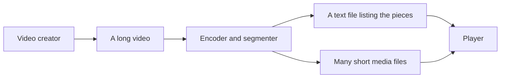
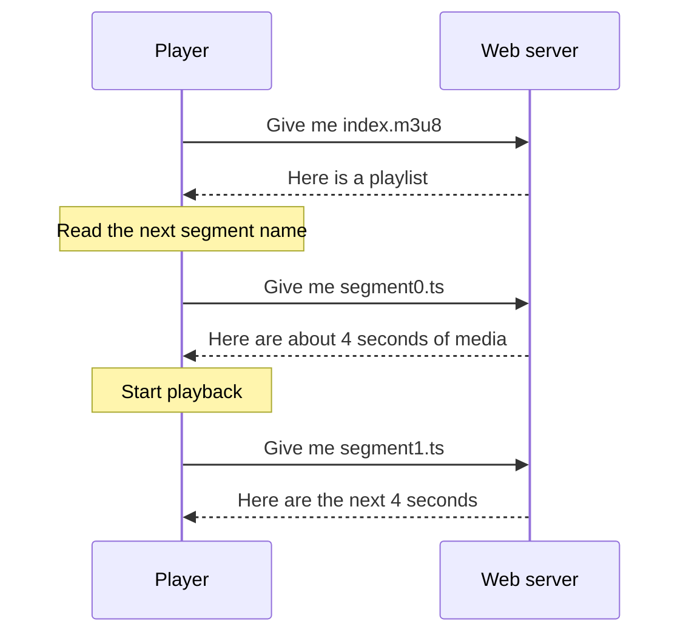

# Start here: no streaming knowledge required

This book assumes that you can read small Scala programs. It does **not** assume
that you already know video encoding, media containers, streaming protocols,
CDNs, or HTTP caching.

Before writing code, keep one simple picture in mind:

HLS is mostly the agreement between the **list**, the **media pieces**, the web
server, and the player. The list is called a *playlist*. A media piece is called
a *segment*.

## The first five words

| Word | Plain meaning |
|---|---|
| HLS | A way to deliver audio or video as a sequence of ordinary web requests |
| Playlist | A UTF-8 text file that tells a player what it can request |
| Segment | A short media resource, often a few seconds long |
| Player | Software that downloads playlists and segments and presents the media |
| Origin | The web server that first publishes the files |

You do not need to memorize these. Every chapter links a new word to the
[glossary](050-glossary.md), and explains it again where it matters.

## What happens when you press Play?

The player does not keep one permanent “video connection” open. It performs a
series of normal HTTP requests. That is why HLS can use familiar web servers,
caches, and CDNs.

## A useful learning rule

Whenever a chapter introduces a tag such as `EXTINF`, ask three questions:

1. Who writes it?
2. Who reads it?
3. What could go wrong if its value is false?

For example, the author writes `EXTINF:4`, the player reads it as “about four
seconds,” and a false duration can make seeking or buffering behave badly. This
cause-and-effect view is more useful than memorizing tag names.

