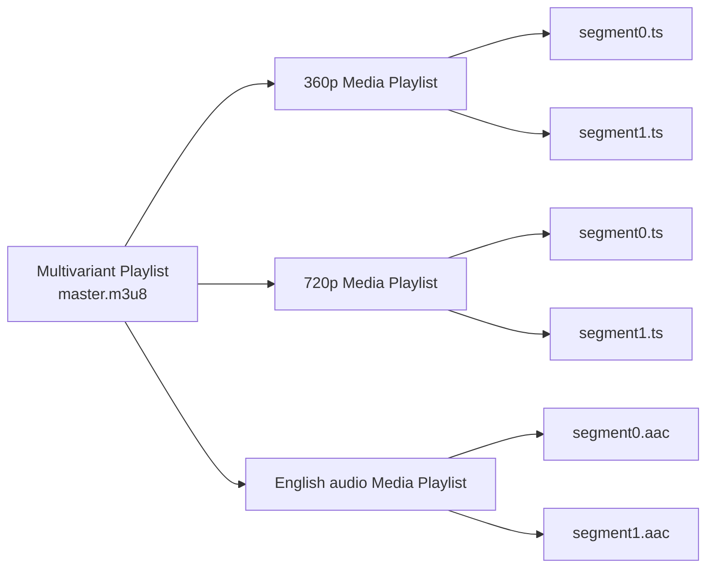
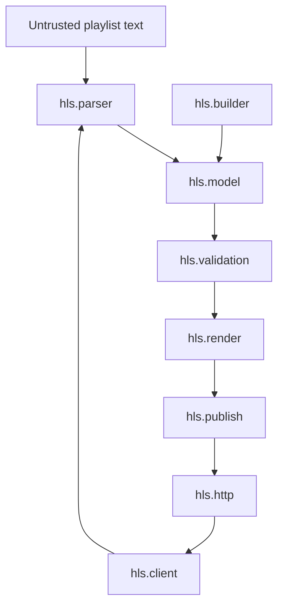

# Map the HLS system before writing it

An HLS presentation is a graph of resources retrieved over time:

The client first chooses a variant from the Multivariant Playlist, then reloads
its Media Playlist and fetches segments. During playback it may switch to a
different aligned variant. HLS is therefore not “a manifest format”; it is a
feedback loop between author, HTTP infrastructure, and client.

## Responsibility boundaries

| Component | Input | Output | Failure we must expose |
|---|---|---|---|
| Encoder | raw samples | compressed samples | incompatible codec/profile |
| Segmenter | compressed timeline | TS/fMP4 resources | bad keyframe/timestamp boundary |
| Playlist author | segment facts | M3U8 snapshots | inconsistent duration/sequence |
| HTTP origin/CDN | immutable resources | HTTP responses | stale or partial publication |
| Client | playlists + segments | continuous playback | insufficient bandwidth/missing data |

The library begins at “playlist author” and includes a reference origin. Later
container chapters inspect segmenter output so invalid media does not hide behind
a syntactically correct playlist.

## Source architecture

Packages are colocated by protocol responsibility:

Tests are physically colocated with this structure: `PlaylistParserSuite.scala`
sits beside `PlaylistParser.scala`, for example. sbt excludes `*Suite.scala`
from Compile and includes it in Test; Scala CLI uses its file-level test-scope
directive. No generic `utils` package is needed: parsing a quoted HLS attribute
is parser knowledge, and advancing a sequence is live playlist knowledge.
