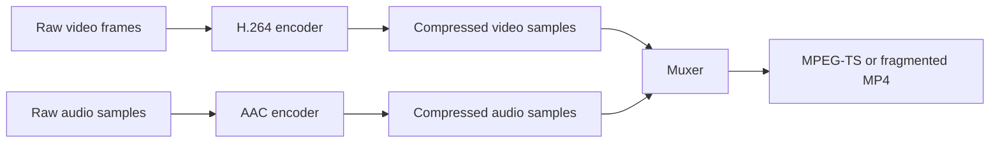
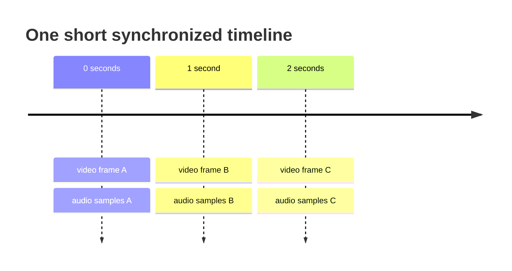
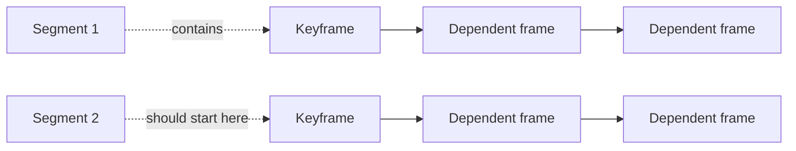

# Media basics: pictures, samples, and containers

This chapter gives only the media knowledge needed for the rest of the book.
Nothing here asks you to implement a video codec.

## From pictures to compressed bytes

A video starts as a sequence of pictures called **frames**. Raw frames are very
large, so an **encoder** compresses them using a **codec** such as H.264. Audio
is similarly divided into samples and compressed, often with AAC.

A codec defines how one kind of media is compressed. A **container** stores
compressed video, audio, timestamps, and descriptive information together. The
verb **mux** means combining tracks into a container; **demux** means separating
them again.

## Why timestamps exist

Audio and video must agree on when each sample is presented. A timestamp is a
number on a timeline, not a wall-clock date.

If timestamps jump unexpectedly, audio may drift away from video. If a segment
begins in the middle of data needed to decode its first picture, switching to it
may show corruption. This is why HLS implementation eventually has to inspect
media boundaries, not only playlist text.

## Keyframes and independent segments

Many compressed video frames depend on earlier frames. A **keyframe** (commonly
an IDR picture for H.264) can begin decoding without earlier picture data. A
segment intended for clean startup or bitrate switching normally begins at such
a boundary.

`EXT-X-INDEPENDENT-SEGMENTS` is therefore a promise about media bytes. Adding
the tag does not magically make segments independent. The encoder and segmenter
must create the correct boundary first.

## What this project implements

The project implements playlist parsing, validation, rendering, publication,
HTTP delivery, and retrieval. Later chapters inspect MPEG-TS and fragmented MP4
structure. It does not compress pictures or sound; mature encoders such as
FFmpeg provide sample data for our experiments.

