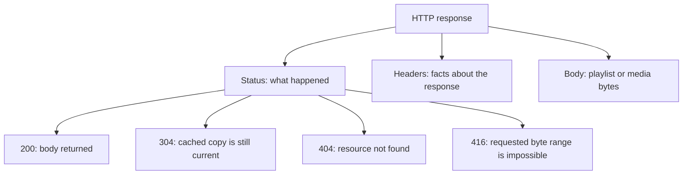
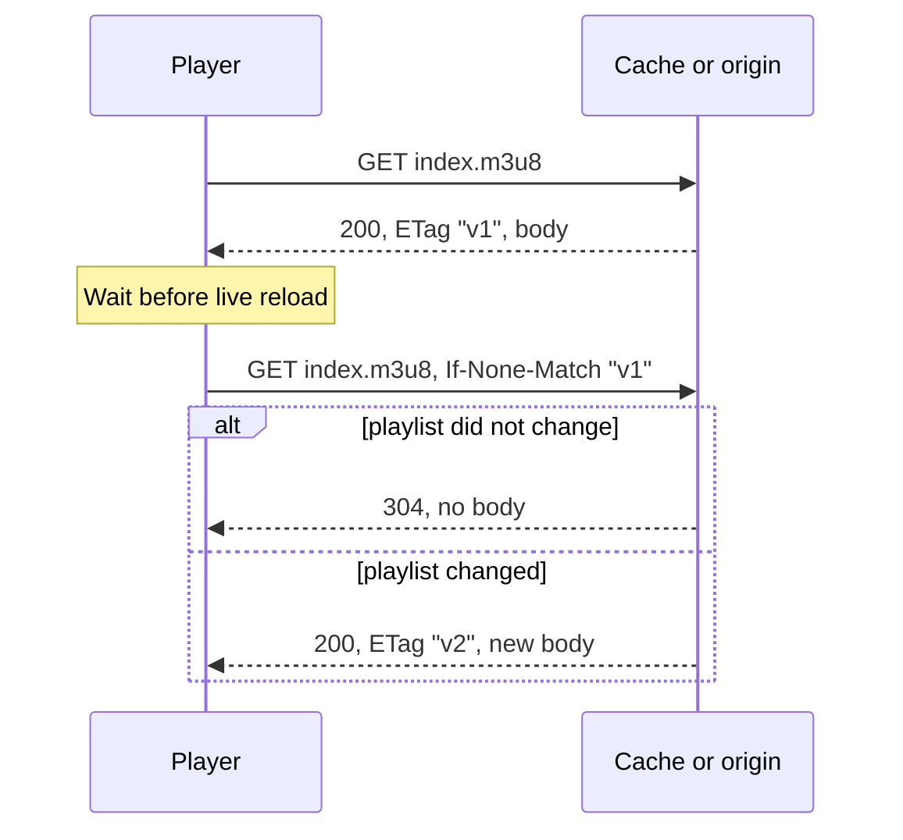

# HTTP basics: requests, responses, and caches

HLS uses HTTP, the same request/response protocol used by web pages. A client
sends a method and URI; the server replies with a status, headers, and sometimes
a body.

```text
GET /live/index.m3u8 HTTP/1.1
Host: media.example
Accept-Encoding: gzip

HTTP/1.1 200 OK
Content-Type: application/vnd.apple.mpegurl
Content-Encoding: gzip
ETag: "version-42"

<playlist bytes>
```

## The pieces of a response



A **header** is a named piece of metadata. `Content-Type` says what the body is.
`Content-Encoding: gzip` says the bytes must be decompressed. `ETag` identifies
a particular version of a resource.

## Why caches need rules

A media segment should never change after publication, so a cache can retain it
for a long time. A live playlist changes repeatedly, so a cache must check
whether it is current.



This is called a **conditional request**. It avoids downloading and parsing the
same playlist again without allowing a stale copy to live forever.

## Byte ranges

A client can request part of a resource with `Range: bytes=100-199`. The server
answers `206 Partial Content` and identifies the returned range. HLS may point
multiple logical segments at different byte ranges of one file, so correct range
support matters even when files are not individually named.

You now know enough HTTP to read the client and origin chapters. Details are
introduced at the point where the implementation needs them.

