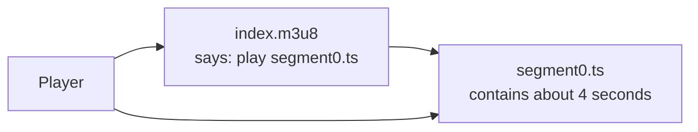

# Publish one four-second segment

> **Before this chapter:** read [Start here](../00-introduction/005-start-here.md).
> You only need the meanings of *playlist* and *segment*.

Our first goal is intentionally tiny: describe one already-encoded MPEG-TS file
and mark the presentation complete.



```m3u8
#EXTM3U
#EXT-X-TARGETDURATION:4
#EXTINF:4,
segment0.ts
#EXT-X-ENDLIST
```

Run [Step01OneSegment.scala](../../examples/steps/Step01OneSegment.scala):

```bash
scala-cli --power run . --server=false --main-class examples.steps.printOneSegment
```

## Read it as a client

1. `#EXTM3U` identifies Extended M3U. It must appear first
   ([RFC 8216 §4.3.1.1](https://www.rfc-editor.org/rfc/rfc8216#section-4.3.1.1)).
2. `TARGETDURATION` says every segment duration, rounded to the nearest integer,
   is at most four seconds
   ([§4.3.3.1](https://www.rfc-editor.org/rfc/rfc8216#section-4.3.3.1)).
3. `EXTINF` gives the following segment URI a four-second duration
   ([§4.3.2.1](https://www.rfc-editor.org/rfc/rfc8216#section-4.3.2.1)).
4. The relative URI resolves against the playlist URI.
5. `ENDLIST` promises no more segments will be appended
   ([§4.3.3.4](https://www.rfc-editor.org/rfc/rfc8216#section-4.3.3.4)).

This playlist does not create `segment0.ts`; the media pipeline must supply it.
For a real experiment, use FFmpeg to create a four-second test pattern, then
place the playlist beside it. FFmpeg is a fixture generator here, not our HLS
implementation.

## What is deliberately wrong with our code?

The Scala program is a multiline string. It can contain a negative duration,
forget the header, or claim a target duration smaller than its segment. That is
fine for one chapter. The next victory is to make those mistakes representable
as errors rather than playable output.

### Exercise

Change `4` to `4.6` in `EXTINF` but keep target duration `4`. Predict whether the
playlist is valid, then read the exact rounding rule in RFC 8216 §4.3.3.1.
