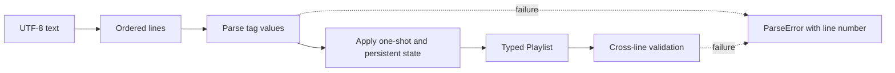

# Parse untrusted playlists

> **Before this chapter:** you should know that a playlist is ordered text and
> that some tags describe the URI on the following line. No compiler theory is
> required.

A parser receives network text, so every assumption becomes an error path. Run
[Step03ParsePlaylist.scala](../../examples/steps/Step03ParsePlaylist.scala):

```bash
scala-cli --power run . --server=false --main-class examples.steps.parsePlaylist -- sample.m3u8
```

The result is either a line-numbered `ParseError` or a typed `Playlist`.



## Why line splitting is only the first step

HLS tags form a state machine. `EXTINF` and `BYTERANGE` apply to the next URI;
`KEY` and `MAP` persist; `DISCONTINUITY` marks a boundary; `DATERANGE` associates
metadata with the timeline. The parser keeps:

- **pending state**, cleared after a segment URI;
- **persistent state**, copied to every segment until replaced;
- **playlist state**, such as version and target duration;
- **accumulated segments**, validated after the final line.

## Attribute lists are not CSV

`CODECS="avc1.4d401f,mp4a.40.2"` contains a comma inside quotes. The tokenizer
walks characters once, toggles quoted state on `"`, and splits only on commas
outside quotes. Duplicate names and unterminated strings fail immediately. The
grammar is in [RFC 8216 §4.2](https://www.rfc-editor.org/rfc/rfc8216#section-4.2).

Unknown extension tags are ignored, allowing newer playlists to pass through an
older client. Known tags are strict: accepting a malformed known tag would turn
an authoring error into surprising playback.

### Exercise

Feed the parser `CODECS="a,b` without the closing quote, then a duplicated
`BANDWIDTH`. Check that both failures point to the tag line rather than a later
variant URI.
