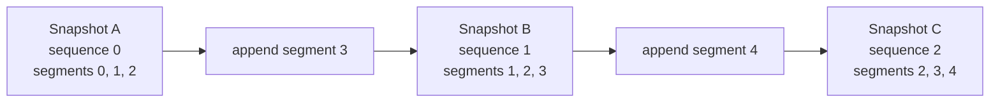

# Build and slide a live window

> **New words:** a *snapshot* is one complete playlist version; a *live window*
> is the recent portion still listed; a *media sequence* numbers its first
> segment. See the [glossary](../00-introduction/050-glossary.md).

A live playlist is a sequence of immutable snapshots. Clients repeatedly reload
the same URI and discover newly appended segments. The server may remove old
segments, but must increase `MEDIA-SEQUENCE` by exactly the number removed.

Run [Step04LiveWindow.scala](../../examples/steps/Step04LiveWindow.scala):

```bash
scala-cli --power run . --server=false --main-class examples.steps.simulateLive
```

After segment 4 arrives, a three-segment window contains segments 2, 3, and 4,
and its media sequence is 2. The identity of a segment is therefore its URI plus
its position in the media sequence, not its local vector index.



## Atomic snapshots

`LivePlaylist` stores an immutable playlist in `AtomicReference`. Append uses a
compare-and-set loop:

1. read the current snapshot;
2. append, trim, and derive the next sequence locally;
3. replace only if no other producer changed the snapshot;
4. otherwise retry against the new state.

Readers never observe “segment appended but sequence not updated.” This is a
small example of why immutable data and atomic state transitions fit protocol
publication well.

RFC 8216's server algorithm is in
[§6.2.2](https://www.rfc-editor.org/rfc/rfc8216#section-6.2.2). It also constrains
how quickly segments may disappear. A fixed count of at least three is a useful
tutorial policy, but a production author should retain enough *duration*, not
assume all segments are equal.

### Exercise

Use durations 1, 1, and 8 with target duration 8. Explain why “three segments”
does not imply a healthy 24-second live window.
