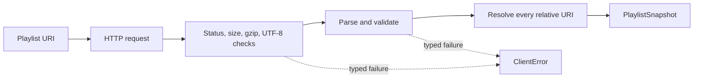

# Load a real playlist over HTTP

> **Before this chapter:** read [HTTP basics](../00-introduction/047-http-basics.md)
> and look up *relative URI* in the [glossary](../00-introduction/050-glossary.md).

Passing a string to `PlaylistParser` proves the grammar, but an application does
not begin with a string. It begins with a URI, an unreliable network, HTTP cache
metadata, a possibly compressed body, and a strict memory budget. `HlsClient`
turns that entire boundary into one typed operation.



```scala
val client = HlsClient.create(
  connectTimeout = Duration.ofSeconds(3),
  requestTimeout = Duration.ofSeconds(8),
  maximumBytes = 2 * 1024 * 1024
)

client.load(URI.create("https://cdn.example/live/master.m3u8")) match
  case Right(snapshot) => use(snapshot.playlist)
  case Left(error)     => report(error)
```

## A snapshot carries evidence

The result is not just `Playlist`. `PlaylistSnapshot` retains:

- the URI requested by the caller;
- the effective URI after redirects;
- the parsed and semantically validated playlist;
- `ETag` and `Last-Modified` validators;
- the instant at which the response was accepted.

Keeping requested and effective URI separate matters. Relative segment URIs
resolve against the effective playlist URI after redirects, not the original
location. [RFC 3986 §5](https://www.rfc-editor.org/rfc/rfc3986#section-5)
defines reference resolution; RFC 8216 uses URI references throughout its
playlist grammar.

`PlaylistResolver` walks the complete domain value and resolves:

- segment URIs;
- fMP4 initialization map URIs;
- encryption key URIs;
- variant playlist URIs;
- alternate rendition URIs.

A resolver that updates only segment URIs is subtly broken: encrypted fMP4 may
play in clear test fixtures but fail when deployed under a nested CDN path.

## Bounded decoding

The client limits both the received byte array and the decompressed gzip body.
This distinction is security-relevant: a small compressed response may expand
far beyond an acceptable playlist size. UTF-8 decoding reports malformed input
instead of replacing bad bytes with U+FFFD, because replacement can mutate a URI
or attribute value.

Failures are an enum rather than exception text:

```scala
enum ClientError:
  case Transport(uri, cause)
  case UnexpectedStatus(uri, status)
  case BodyTooLarge(uri, maximumBytes)
  case UnsupportedEncoding(uri, encoding)
  case InvalidUtf8(uri)
  case InvalidPlaylist(uri, error)
```

Callers can retry transport errors, reject invalid content permanently, and
surface parser line numbers without scraping messages.

## Redirect policy

The Java HTTP client uses `Redirect.NORMAL`: ordinary HTTP-to-HTTP and
HTTPS-to-HTTPS redirects are followed, but HTTPS is not silently downgraded to
HTTP. The final URI is captured from the response and becomes the resolution
base. Credentials are intentionally outside this small API; applications should
construct an authenticated transport boundary appropriate to their key and
content policy.

### Exercise

Create an endpoint that redirects `/master.m3u8` to `/v2/master.m3u8`, whose
variant is `video.m3u8`. Assert that the resolved URI ends in
`/v2/video.m3u8`, not `/video.m3u8`.
