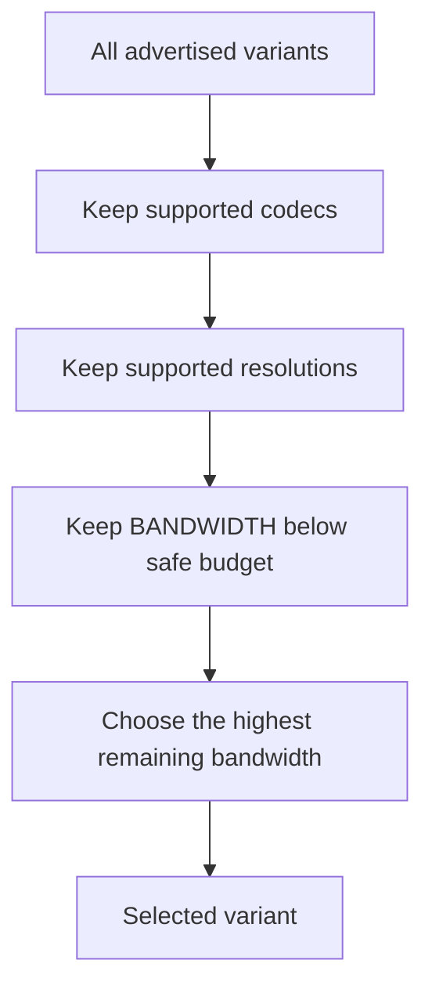

# Choose a variant without guessing

A Multivariant Playlist can advertise several versions of the same presentation.
The player needs one it can decode and download fast enough.



`BANDWIDTH` is a declared peak rate for everything needed to play the variant.
If measured throughput is 3 Mbit/s, choosing a 3 Mbit/s variant leaves no room
for variability. `PlaybackCapabilities` defaults to using 80% of the estimate:

```scala
val capabilities = PlaybackCapabilities(
  estimatedBitsPerSecond = 3_000_000,
  supportedCodecPrefixes = Set("avc1", "mp4a"),
  maximumWidth = Some(1920),
  maximumHeight = Some(1080)
)

val selected = VariantSelector.select(master.variants, capabilities)
```

The selector is pure: it does not pretend to know how throughput should be
measured. A player derives that estimate from recent transfers, chooses how
quickly to react, and can apply hysteresis to prevent constant quality changes.

## Codec strings

HLS uses RFC 6381 codec identifiers such as `avc1.4d401f`. The prefix identifies
the codec family; later fields describe profile and level. The example selector
accepts configured prefixes. A production decoder capability check may need to
understand the full profile and level rather than only `avc1` versus `hvc1`.

## Why choose peak bandwidth?

`AVERAGE-BANDWIDTH` is helpful for ranking and long-term planning, but admission
must respect `BANDWIDTH`: a player that can sustain the average may still stall
on peaks. The declarative test table covers limited networks, unsupported HEVC,
display limits, and the no-affordable-variant case.

