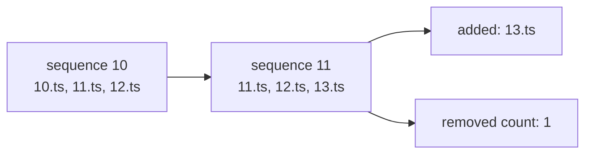

# Reconcile live snapshots by sequence number

The same live playlist URI returns different immutable snapshots over time.
Vector index zero does not always identify the same segment.



`MediaPlaylistReconciler` assigns each vector element its absolute media sequence
and compares overlapping identities. Its result is one of:

- `Unchanged` — same sequence range, segment URIs, and end state;
- `Advanced` — valid additions and optional eviction;
- `Rewound` — sequence moved backwards, suggesting reset or wrong identity;
- `Inconsistent` — one overlapping sequence now names another URI.

```scala
MediaPlaylistReconciler.reconcile(previous, current) match
  case MediaPlaylistUpdate.Advanced(added, removed) => enqueue(added)
  case MediaPlaylistUpdate.Unchanged                => scheduleReload()
  case error                                        => restartOrFail(error)
```

This pure comparison does not fetch bytes or schedule retries. Keeping those
concerns separate makes rewind and overlap failures reproducible in a small test
instead of depending on timing in a background thread.

