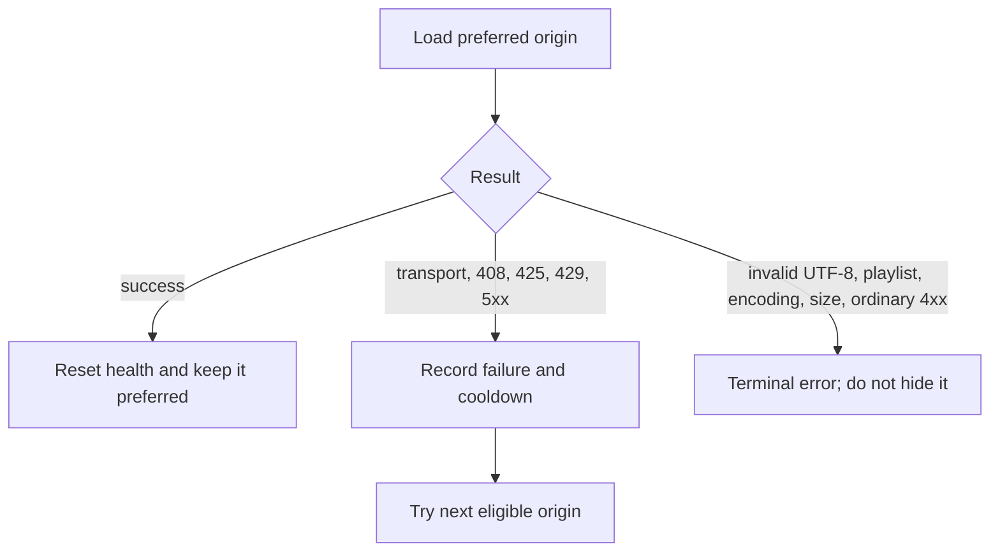

# Fail over without hiding broken content

Two URLs may publish equivalent playlists from independent origins. Failover is
useful only if the client distinguishes a temporarily unhealthy source from bad
content that every equivalent source should fix.



`FailoverState` is immutable and contains each URI's consecutive failure count,
retry time, and the last successful preferred index. The caller stores the new
state returned by each operation; the library creates no hidden scheduler.

```scala
val state = FailoverState.create(Vector(primary, backup)).toOption.get
val redundant = FailoverPlaylistClient.create(
  HlsClient.create(),
  FailoverPolicy(
    initialCooldown = Duration.ofSeconds(1),
    maximumCooldown = Duration.ofSeconds(30)
  )
)

redundant.load(state, Instant.now())
```

## Why some failures are terminal

An invalid playlist is evidence that publication is broken, not that the network
is temporarily unavailable. Trying a backup and silently succeeding would hide
the error and make two supposedly equivalent origins behave differently.
Authentication failures are similarly terminal: a client must not route around
an authorization decision.

Retryable failures use exponential cooldown capped by policy. If every origin is
cooling down, the one with the earliest retry time is attempted so the API never
returns an empty diagnostic merely because the caller invoked it early.

## Conditional reload across origins

ETag and Last-Modified validators belong to a resource at one origin. The
preferred origin receives a conditional reload; after failover, another origin
receives a fresh unconditional load. The fallback body is reported as
`ReloadResult.Modified`, even when its segment list happens to match.

The tests use real local HTTP responses for 503, ETag, invalid content, and
backup success. Request counters prove that the newly healthy origin becomes
preferred rather than repeatedly paying the failed-primary latency.

