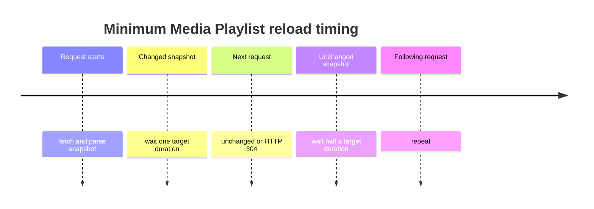
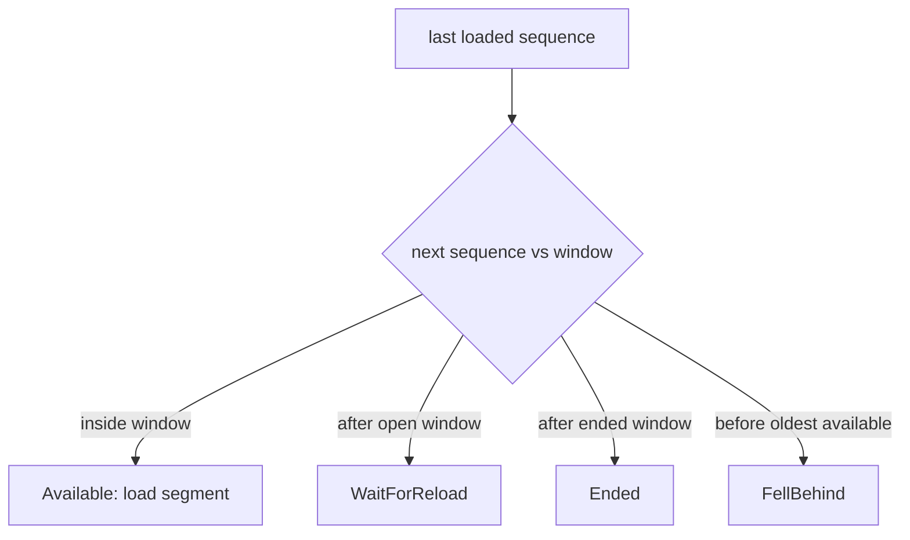

# Schedule live reloads without overloading the origin

A live client must reload, but it must not reload as fast as its network allows.
RFC 8216 measures the minimum delay from the **start** of the previous request.



`LiveReloadPlanner` returns a value, not a sleeping thread:

```scala
LiveReloadPlanner.next(playlist, observation, requestStartedAt) match
  case ReloadDecision.At(earliest, delay) => scheduler.wakeAt(earliest)
  case ReloadDecision.Stop(reason)        => stopReloading(reason)
```

Initial and changed snapshots wait one target duration. An unchanged snapshot
waits half the target duration. An ended playlist or VOD stops. Because the
planner accepts the request start instant, slow response parsing does not
accidentally add or remove time from the RFC minimum.

## Choose the next segment by absolute sequence

After each reload, `NextSegmentSelector` chooses the lowest advertised media
sequence greater than the last loaded sequence.



`FellBehind` is not the same as waiting: the needed segment has already been
evicted. The caller must seek/restart according to playback policy. Media
sequence numbers must never be used to synchronize different variant streams;
cross-variant synchronization uses durations and media timestamps.

See [RFC 8216 §6.3.4](https://www.rfc-editor.org/rfc/rfc8216#section-6.3.4)
and [§6.3.5](https://www.rfc-editor.org/rfc/rfc8216#section-6.3.5).

