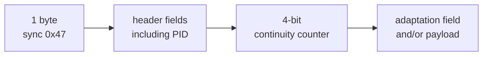
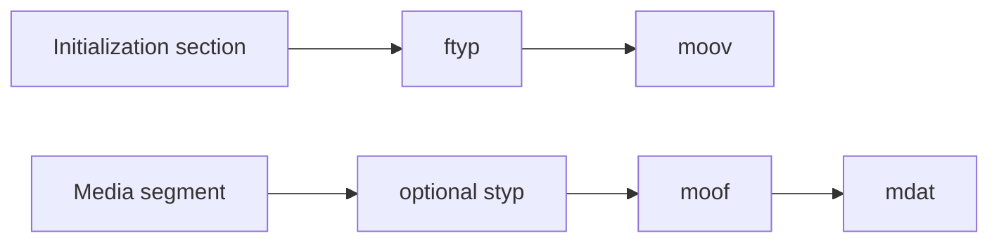
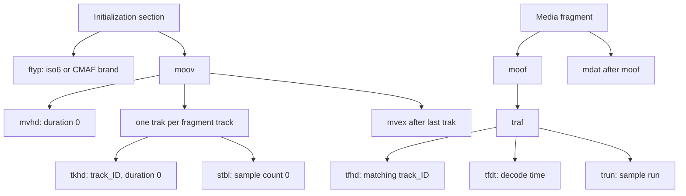

# Inspect media structure without writing a codec

A playlist can be perfect while its segment bytes are corrupt. Structural
inspection catches a useful class of authoring failures before a device-specific
decoder reports an opaque playback error.

## MPEG-TS packets

MPEG-TS is a stream of fixed-size 188-byte packets. Every packet begins with the
sync byte `0x47`, identifies a PID, and carries a four-bit continuity counter for
payload packets.

`MpegTsInspector` checks total alignment, every sync byte, and continuity per
PID. It recognizes the discontinuity indicator and ignores the null-packet PID.
It does not yet parse PAT, PMT, PES, PTS, or codec payloads.

## Fragmented MP4 boxes

ISO Base Media File Format stores data in nested boxes. Each top-level box begins
with a size and four-character type.

`Fmp4Inspector` safely walks a bounded nested box tree, including extended
64-bit sizes, and rejects truncated or out-of-bounds declarations.

Initialization inspection requires an `iso6`-compatible or CMAF `ftyp`, a
`moov`, zero `mvhd`/`tkhd` durations, zero `stsz` sample counts, and `mvex` after
the final track. Fragment inspection requires every `traf` to contain `tfhd`,
`tfdt`, and `trun`, rejects absolute base-data offsets, and can compare fragment
track IDs with the initialization section.

This is deliberately called structural inspection. Sample-entry codecs,
data-reference tables, every `trun` address, and sample payloads still require
deeper validation. The [coverage matrix](../reference/rfc8216-coverage.md) keeps
those missing layers visible.

## Packed audio and WebVTT

Packed AAC, MP3, AC-3, and E-AC-3 segments need an ID3 PRIV frame at the start.
Its owner is `com.apple.streaming.transportStreamTimestamp`; its eight-byte
payload carries a 33-bit MPEG timestamp. `PackedAudioInspector` parses ID3v2.3
and v2.4 frame sizes far enough to extract and validate that HLS timestamp.

`WebVttInspector` validates the `WEBVTT` header, cue timing-line shape, and the
optional `X-TIMESTAMP-MAP` that relates local cue time to the MPEG timeline.
Neither inspector decodes media or renders captions: they verify the HLS-specific
envelope around those payloads.
