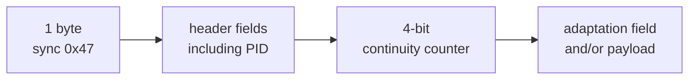
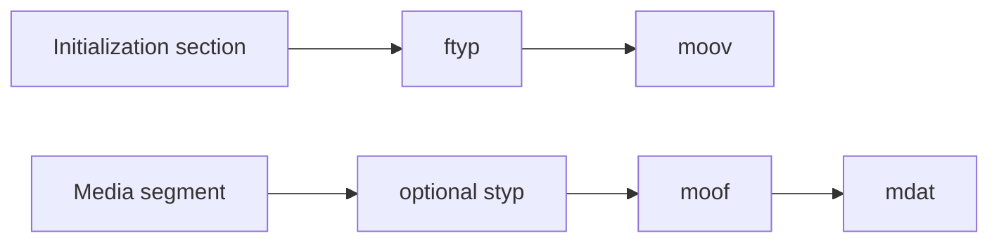

# Inspect media structure without writing a codec

A playlist can be perfect while its segment bytes are corrupt. Structural
inspection catches a useful class of authoring failures before a device-specific
decoder reports an opaque playback error.

## MPEG-TS packets

MPEG-TS is a stream of fixed-size 188-byte packets. Every packet begins with the
sync byte `0x47`, identifies a PID, and carries a four-bit continuity counter for
payload packets.

`MpegTsInspector` checks total alignment, every sync byte, and continuity per
PID. It recognizes the discontinuity indicator and ignores the null-packet PID.
It does not yet parse PAT, PMT, PES, PTS, or codec payloads.

## Fragmented MP4 boxes

ISO Base Media File Format stores data in nested boxes. Each top-level box begins
with a size and four-character type.

`Fmp4Inspector` safely walks top-level boxes, including extended 64-bit sizes,
and rejects truncated or out-of-bounds declarations. Initialization inspection
requires `ftyp` and `moov`; media inspection requires `moof` before `mdat`.

This is deliberately called structural inspection. RFC 8216 additionally
requires nested `tfdt` and track-fragment behavior. Codec samples and encryption
must also be valid. The [coverage matrix](../reference/rfc8216-coverage.md) keeps
those missing layers visible.
