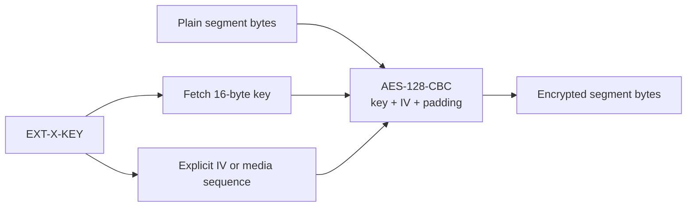

# Encrypt and decrypt whole Media Segments

`EXT-X-KEY:METHOD=AES-128` means that the complete segment bytes are encrypted
with AES-128 in CBC mode and PKCS#7 padding. The playlist tells the client where
to obtain the 16-byte key and which initialization vector (IV) to use.



`Aes128Key.from` accepts exactly 16 bytes and copies them. Its `toString` is
redacted so ordinary logging does not reveal key material. `InitializationVector`
accepts the 32-hex-digit playlist representation. When the playlist omits IV,
RFC 8216 §5.2 places the media sequence number in the low 64 bits of a zero-filled
128-bit big-endian value.

```scala
val key = Aes128Key.from(keyResponseBody).toOption.get
val iv = explicitIv
  .flatMap(value => InitializationVector.parse(value).toOption)
  .getOrElse(InitializationVector.fromMediaSequence(sequence))

val plaintext = Aes128SegmentCipher.decrypt(ciphertext, key, iv)
```

Java names the padding transformation `PKCS5Padding`; for AES's 16-byte block
size the provider implements the PKCS#7 behavior HLS requires. Bad padding or a
wrong key returns `DecryptionFailed`, never partial plaintext.

## Security boundary

The cipher does not decide how key URIs are authenticated, cached, rotated, or
authorized. Applications should use TLS, avoid persistent key logging, minimize
key lifetime, and keep content authorization separate from public segment
caching. `SAMPLE-AES` is a different scheme that encrypts selected parts of
samples according to their media format; whole-segment AES code cannot implement
it safely.

See [RFC 8216 §5](https://www.rfc-editor.org/rfc/rfc8216#section-5),
[§6.2.3](https://www.rfc-editor.org/rfc/rfc8216#section-6.2.3), and
[§6.3.6](https://www.rfc-editor.org/rfc/rfc8216#section-6.3.6).

