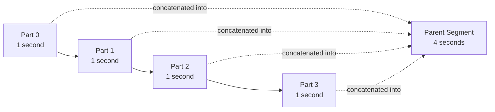
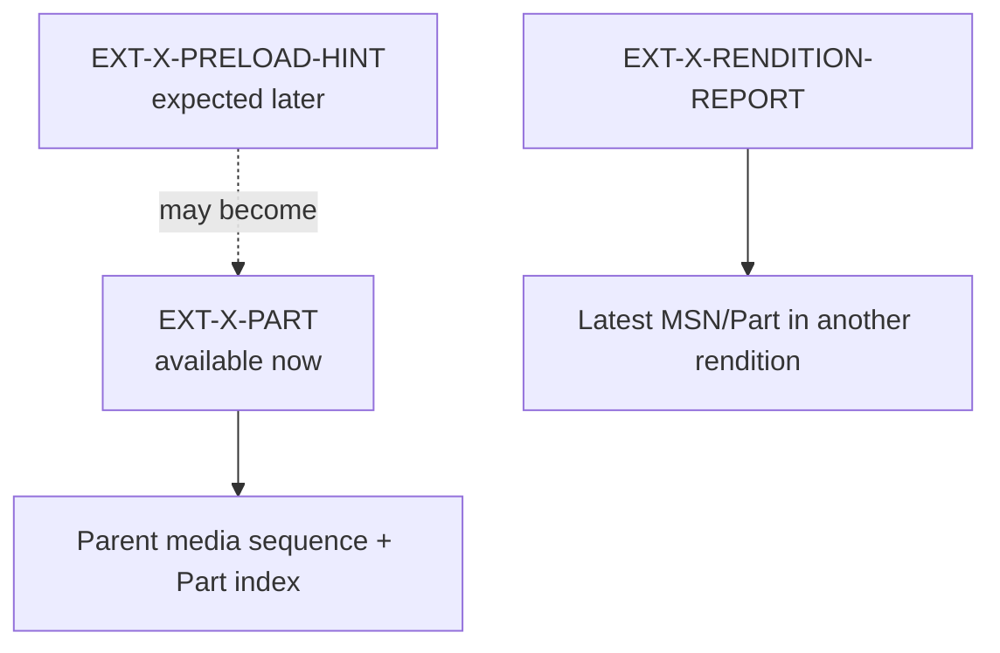

# Low-Latency HLS core, based on draft-22

This chapter implements the core Low-Latency HLS features from
`draft-pantos-hls-rfc8216bis-22` (1 May 2026). It is an active Internet-Draft,
not yet an RFC. The exact revision matters because attributes and constraints
can change between drafts.

## Why ordinary segments add latency

An ordinary client learns about a segment after the author finishes and
publishes it. With a four-second segment, the newest media may already be
several seconds old. Low-Latency HLS also publishes smaller **Partial Segments**
while the Parent Segment is still being produced.



The Parts and Parent Segment describe overlapping media, not five consecutive
pieces. Older clients ignore unknown Part tags and continue requesting complete
Parent Segments.

`PartialSegment` stores `parentMediaSequence` and `partIndex` explicitly. This
prevents a flat URI list from losing the identity needed by `_HLS_msn` and
`_HLS_part`.

## Playlist-wide low-latency configuration

`EXT-X-PART-INF` declares the maximum Part Target Duration. If Parts exist, this
tag is required.

`EXT-X-SERVER-CONTROL` declares delivery features and latency recommendations:

- `CAN-BLOCK-RELOAD` — the origin may hold a reload request until requested
  media exists;
- `CAN-SKIP-UNTIL` — the origin can return Delta Updates and gives the skip
  boundary;
- `CAN-SKIP-DATERANGES` — Delta Updates may omit old date ranges;
- `HOLD-BACK` — recommended distance from the ordinary live edge;
- `PART-HOLD-BACK` — recommended distance in low-latency mode.

Validation enforces the important lower bounds:

```text
CAN-SKIP-UNTIL >= 6 × TARGETDURATION
HOLD-BACK      >= 3 × TARGETDURATION
PART-HOLD-BACK >= 2 × PART-TARGET
```

Apple's current authoring guidance recommends at least three Part Target
Durations for `PART-HOLD-BACK`, but draft-22 defines two as the protocol minimum.
The library validates the protocol floor; a stricter authoring profile belongs
in a separate policy validator.

## Parts, hints, and rendition reports



A preload hint is not a promise that the exact Part will appear. Segmentation,
discontinuity, map, or encryption state may change before publication. An ended
playlist cannot contain a preload hint.

Rendition Report URIs must be relative. They let a client switch bitrate near
the live edge without first performing an extra discovery reload. `LAST-MSN`
and `LAST-PART` are optional in the model because draft-22 permits omission when
their values equal the containing playlist's report.

## Byte-range Parts

Parts may share one growing resource. If `BYTERANGE` omits its offset, the offset
begins after the previous Part belonging to the same Parent Segment. The parser
resolves this implicit value and the canonical renderer writes it explicitly.
Offsets reset at each Parent Segment boundary.

## Source layout

- `hls.model.LowLatency` — typed tags and identities;
- `hls.parser.LowLatencyParser` — strict attribute parsing;
- `PlaylistParser` — ordered association with Parent Segments;
- `PlaylistRenderer` — canonical placement before each Parent Segment;
- `PlaylistValidator` — duration, hold-back, uniqueness, and terminal-state
  constraints;
- `PlaylistResolver` — Part, hint, and report URI resolution.

The round-trip test includes Parts before a completed Parent, trailing Parts at
the live edge, implicit byte ranges, a preload hint, rendition report, server
control, and a Delta Update.

