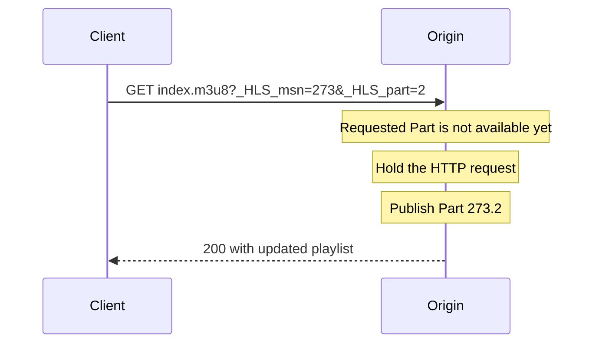
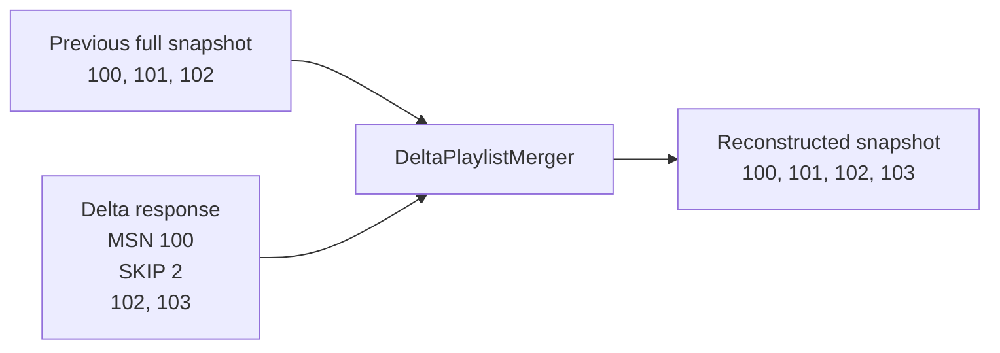

# Blocking reloads and Playlist Delta Updates

Low-Latency clients reload more frequently. Delivery Directives let a client
ask for a specific live-edge position and avoid downloading an unchanged early
playlist prefix.

## Reserved query parameters

```text
_HLS_msn=273       wait for Media Sequence 273 or later
_HLS_part=2        wait for Part 2 of that sequence or later
_HLS_skip=YES      request a Delta Update
_HLS_skip=v2       also permit date-range skipping
```

`_HLS_part` is meaningless without `_HLS_msn`, so `DeliveryDirectives.create`
rejects that state. It also rejects negative sequence and Part values and an
empty directive set. Applying directives preserves an existing authorization
query and URI fragment:

```scala
val directives = DeliveryDirectives.create(
  mediaSequence = Some(273),
  part = Some(2),
  skip = Some(SkipRequest.V2)
).toOption.get

val requestUri = directives.applyTo(playlistUri)
```

## Blocking does not mean polling faster



The server advertises blocking support with `CAN-BLOCK-RELOAD=YES`. A client
must still apply request timeouts and cancellation. If the server does not
advertise support, ordinary reload timing applies.

## A Delta Update is not a complete standalone history

`EXT-X-SKIP:SKIPPED-SEGMENTS=2` replaces the first two segment lines and their
segment tags. `MEDIA-SEQUENCE` does not advance merely because those lines were
replaced.



The merger indexes the previous snapshot by absolute media sequence. If any
required skipped sequence is no longer available, it returns
`MissingSkippedSequence`; the caller must request a full playlist without
`_HLS_skip`. It also removes date ranges listed by
`RECENTLY-REMOVED-DATERANGES`.

This separation is deliberate: parsing proves the Delta response is valid,
while merging requires historical state from a particular playlist identity.

