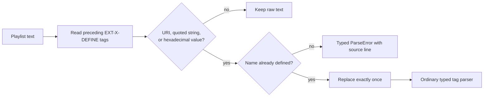

# Playlist variables without magical global state

HLS 2 adds `EXT-X-DEFINE` and references such as `{$cdn}`. They reduce repeated
host names, tokens, and pathway values. This chapter follows
[`draft-pantos-hls-rfc8216bis-22` §4.3 and §4.4.2.3](https://datatracker.ietf.org/doc/html/draft-pantos-hls-rfc8216bis-22#section-4.3).
The draft is active, so the revision is part of this implementation's contract.

## First: this is not general template interpolation

Only three syntactic locations are eligible:

- a URI line;
- a quoted-string attribute value;
- a hexadecimal-sequence attribute value.

A decimal value such as `TARGETDURATION:{$duration}` is not eligible. A
replacement is performed once: references inside the replacement value remain
literal. This prevents a value supplied by a query parameter from unexpectedly
turning into executable template input.



The implementation performs this pass before ordinary tag parsing, but it
preserves source line numbers. Consequently every existing URI and attribute
parser receives already-expanded input without learning template syntax.

## Three ways to obtain a value

### `NAME` and `VALUE`

```m3u8
#EXT-X-DEFINE:NAME="cdn",VALUE="media.example.com"
#EXT-X-STREAM-INF:BANDWIDTH=800000
https://{$cdn}/video.m3u8
```

The name is case-sensitive and may contain letters, digits, `-`, and `_`.
Duplicate names fail instead of silently shadowing an earlier value.

### `QUERYPARAM`

```m3u8
#EXT-X-DEFINE:QUERYPARAM="token"
#EXTINF:4,
segment.ts?authorization={$token}
```

For a playlist loaded from `index.m3u8?token=a%2Fb`, the replacement is `a/b`.
The client uses the effective URI after redirects, percent-decodes the selected
value, and rejects values that cannot occur inside a quoted string. A missing
parameter is a parsing failure.

### `IMPORT`

Variables do not leak from a Multivariant Playlist into Media Playlists. The
Media Playlist must opt in:

```m3u8
#EXT-X-DEFINE:IMPORT="cdn"
#EXTINF:4,
https://{$cdn}/segment.ts
```

`PlaylistParser.parseWithVariables` returns the Multivariant Playlist together
with its immutable variable environment. Pass that map as `VariableContext` to
the child parse, or as `importedVariables` to `HlsClient.load`. Imports are
forbidden in Multivariant Playlists and are not retained between reloads unless
the caller supplies them again.

## Why the context is explicit

```scala
val master = PlaylistParser.parseWithVariables(masterText).toOption.get

val media = PlaylistParser.parse(
  mediaText,
  VariableContext(imported = master.definedVariables)
)
```

An explicit immutable value makes playlist identity, redirects, reloads, and
tests observable. A process-wide variable map would allow one viewer or origin
to contaminate another and would violate the draft's non-persistence rule.

The colocated `VariableSubstitutionSuite` states the protocol as examples:
preceding definitions work, forward references fail, nested references are not
re-expanded, query values are decoded, duplicate names fail, and imports must be
provided deliberately.
