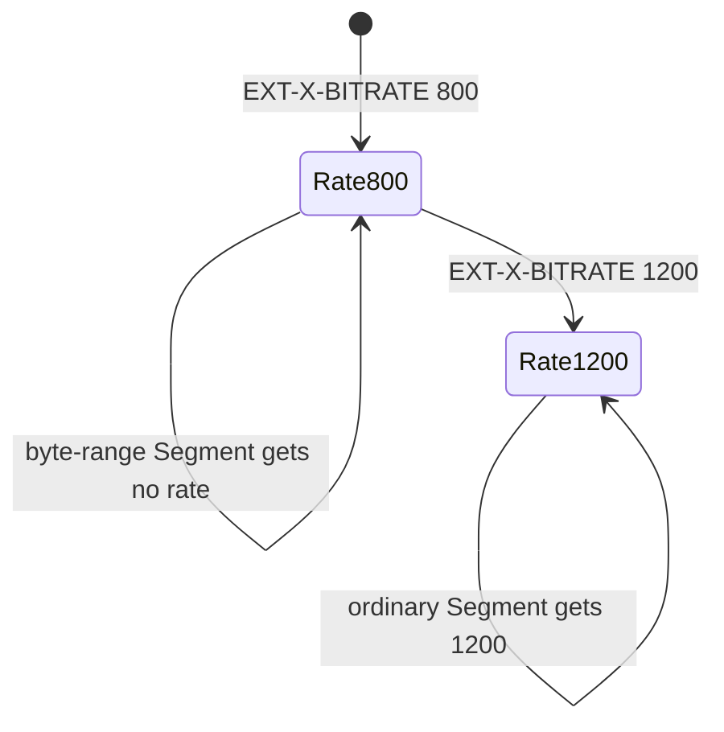

# Declaring and checking segment bitrate

`EXT-X-BITRATE` gives a client an approximate rate before it downloads a Media
Segment. The normative definition is in
[`draft-pantos-hls-rfc8216bis-22` §4.4.4.8](https://datatracker.ietf.org/doc/html/draft-pantos-hls-rfc8216bis-22#section-4.4.4.8).
The unit is **kilobits per second**, not bits per second and not kilobytes per
second.

```m3u8
#EXT-X-BITRATE:800
#EXTINF:4,
segment-0.ts
#EXTINF:4,
segment-1.ts
```

The declaration remains active until another `EXT-X-BITRATE` appears. One
exception matters: it does not apply to a Segment with `EXT-X-BYTERANGE`.
Skipping that Segment does not erase the declaration.



The parser therefore stores a rate on each applicable immutable
`MediaSegment`. The renderer emits only state changes and preserves the rule
across byte-range Segments. Parsing the rendered result reconstructs the same
model.

## The manifest alone cannot prove accuracy

The declared value must be between 90% and 110% of every applicable Segment's
actual rate. Parsing cannot validate this because a playlist does not contain
the encoded byte length.

For a complete Segment:

```text
measured kbps = encoded bytes × 8 / duration seconds / 1000
```

`SegmentBitrateValidator` asks the caller for each resource length. It accepts
the inclusive 90% and 110% boundaries and returns typed errors for an inaccurate
declaration or missing media metadata. Byte-range Segments do not request a
length because the tag does not apply to them.

This split keeps responsibilities honest:

- `PlaylistParser` validates syntax and scoping;
- `PlaylistValidator` validates manifest-only invariants;
- `SegmentBitrateValidator` validates the claim against encoded media known to
  a packager, filesystem origin, or object store.
